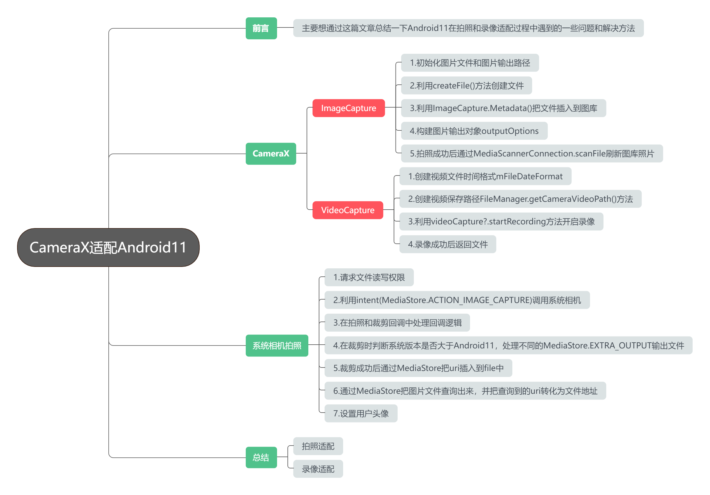

# CameraXApp

#### 介绍
Android CameraX相机Api的使用实例

#### 软件架构
Android中CameraX的使用，实现拍照、录像、预览、切换摄像头,

#### 安装教程

1.  利用mediastore插入图库
2.  保存图片通过uri转化为文件
3.  利用mediastore查询出图片

#### 使用说明
Android11适配，Android11拍照时需要将路径转为uri，否则会报错
1.  方法如下：
   /**
     * 通过媒体文件Uri获取文件-Android 11兼容
     *
     * @param fileUri 文件Uri
     */
    public static File getMediaUri2File(Uri fileUri) {
        String[] projection = {MediaStore.Images.Media.DATA};
        Cursor cursor = MyApp.getInstance().getContentResolver().query(fileUri, projection,
                null, null, null);
        if (cursor != null) {
            if (cursor.moveToFirst()) {
                int columnIndex = cursor.getColumnIndexOrThrow(MediaStore.Images.Media.DATA);
                String path = cursor.getString(columnIndex);
                cursor.close();
                return new File(path);
            }
        }
        return null;
    }
2. Android11文件存储目录： 必须为系统目录，比如：DCIM、PICTURE、MUSIC、DOWNLoad等;
3. 参考项目FileManager基本目录 String SAVE_MEDIA_ROOT_DIR = File.separator + Environment.DIRECTORY_DCIM

#### 参与贡献

1.  Fork 本仓库
2.  新建 Feat_xxx 分支
3.  提交代码
4.  新建 Pull Request

#### 特技

1.  使用 Readme\_XXX.md 来支持不同的语言，例如 Readme\_en.md, Readme\_zh.md
2.  Gitee 官方博客 [blog.gitee.com](https://blog.gitee.com)
3.  你可以 [https://gitee.com/explore](https://gitee.com/explore) 这个地址来了解 Gitee 上的优秀开源项目
4.  [GVP](https://gitee.com/gvp) 全称是 Gitee 最有价值开源项目，是综合评定出的优秀开源项目
5.  Gitee 官方提供的使用手册 [https://gitee.com/help](https://gitee.com/help)
6.  Gitee 封面人物是一档用来展示 Gitee 会员风采的栏目 [https://gitee.com/gitee-stars/](https://gitee.com/gitee-stars/)
